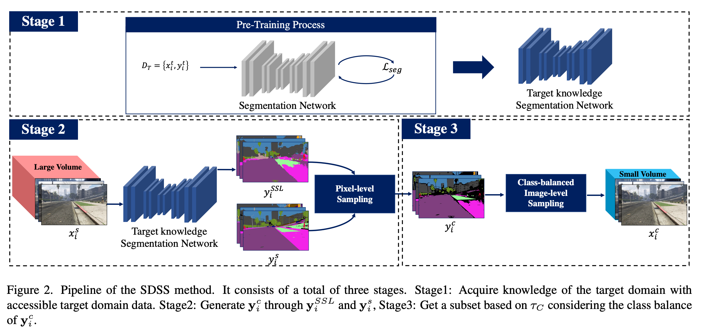

# Source Domain Subset Sampling for Semi-supervised Domain Adaptation in Semantic Segmentation

## Introduction

### Abstract

<div style="text-align:justify">
In this paper, we introduce source domain subset sampling (SDSS) as a new perspective of semi-supervised domain adaptation. We propose domain adaptation by sampling and exploiting only a meaningful subset from source data for training. Our key assumption is that the entire source domain data may contain samples that are unhelpful for the adaptation. Therefore, the domain adaptation can benefit from a subset of source data composed solely of helpful and relevant samples. The proposed method effectively subsamples full source data to generate a small-scale meaningful subset. Therefore, training time is reduced, and performance is improved with our subsampled source data. To further verify the scalability of our method, we construct a new dataset called Ocean Ship, which comprises 500 real and 200K synthetic sample images with ground-truth labels. The SDSS achieved a significant performance improvements when applied on GTA5 → Cityscapes and SYNTHIA → Cityscapes public benchmark datasets and a 9.13 mIoU improvement on our Ocean Ship dataset over a baseline model. 
</div>

## SDSS Overview


## OceanShip Dataset Preview


## Dataset

Please download the datasets from these links:

<pre>
 <code>
 [Cityscapes]
  <a href="https://www.cityscapes-dataset.com">Cityscapes Download Link</a>
  
 [GTA5]
  <a href="https://download.visinf.tu-darmstadt.de/data/from_games">GTA5 Download Link</a>

 [SYNTHIA]
  <a href="https://synthia-dataset.net">SYNTHIA Download Link</a>

 [OceanShip (Real)]
  TODO
  
 [OceanShip (Synthetic)]
  TODO
 </code>
</pre>


## Train & Test
```
 - TODO
```
